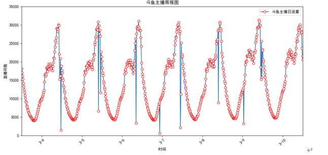
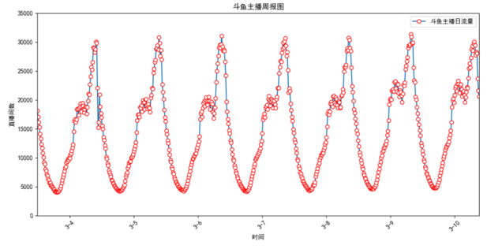
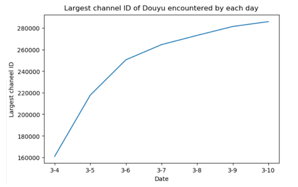
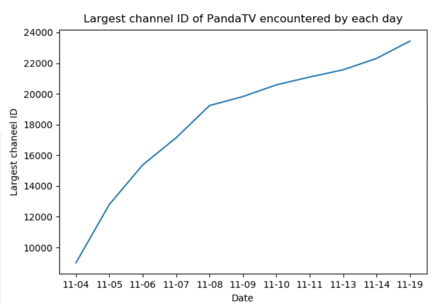
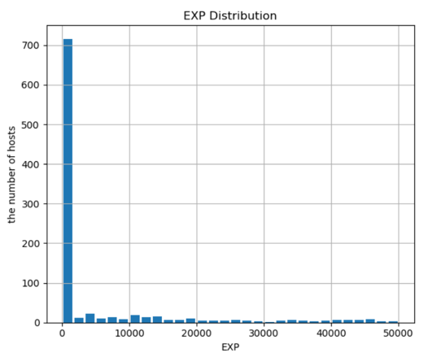
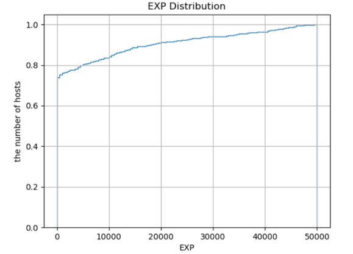
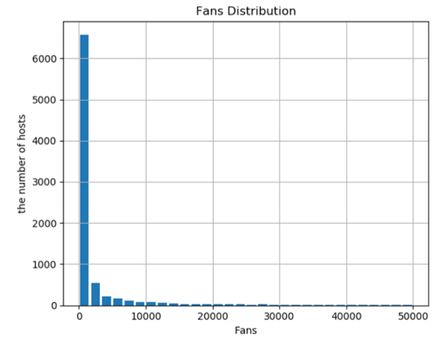
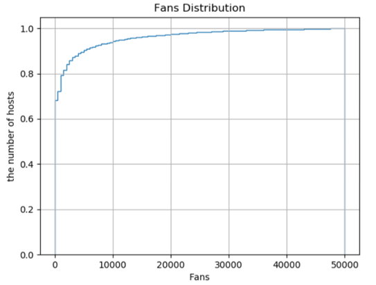
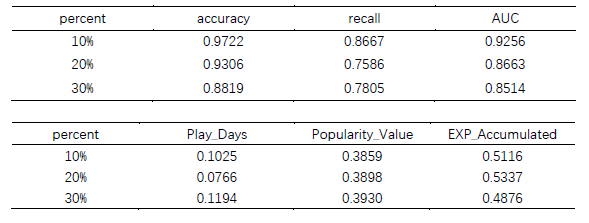
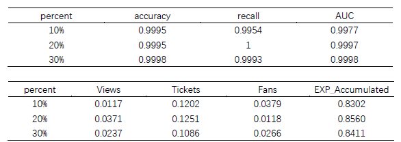

# Income-prediction-model-of-lives-sharing-platforms-based-on-machine-learning.
The classification prediction model based on Random Forest and Support Vector Machine algorism. Data collected from Chineses biggest live-sharing platform DouyuTV and PandasTV(for codes see my other repositories).

# Data Scaping
For data collection python programs, visit:

https://github.com/QiyuanMa/pandaTV_data_spider
https://github.com/QiyuanMa/DouyuTV_data_spider

# Abstract

With the rapid development of the online live broadcast economy, the live broadcast platform has begun to take shape although it has only developed for more than ten years, especially the crowdsourcing platform led by douyu TV and panda TV in China. However, at present, the research on the network live broadcasting platform is still a relatively new field, and the relationship between the host and the user behavior is still a fuzzy concept for the benefit relationship of the host and even the platform. In order to solve this problem, this paper analyzes the correlation between the host's income and the user's behavior factors, and puts forward a kind of classified prediction model of the host's income based on the random forest machine learning algorithm, gives the influence degree of the user's behavior factors on the host's income prediction, and realizes the prediction of the high-income host with high accuracy. On the one hand, it helps the anchor to improve the live broadcast behavior in order to achieve a higher benefit effect. On the other hand, it provides a reasonable reference for the operation and investment strategy of the live broadcast platform, and explores the features of the anchor that can bring a higher benefit to the platform, so as to make a better decision on the signing of the anchor.            

Based on the analysis of the income of the two domestic live broadcast platforms of douyu and panda, this paper obtains 2634562 and 1712396 room information of douyu and panda, including 307458 ID and 23436 panda platforms. Through the screening and cleaning of the relevant data of the income of the anchor crawled in the early stage, the income of the two platforms is divided into two parts In the comparison between SVM support vector machine and random forest algorithm, it is found that random forest is more suitable for this research model. Finally, the best matching algorithm of the prediction model is obtained by cross validation and optimal parameter search. The test results show that the accuracy of the two platform models is more than 90%. At the same time, compared with the current related platform research, the project adopts the method of multi factor analysis to further improve the accuracy of the prediction.            

The algorithm model used in the experiment can be applied to a variety of crowdsourcing platforms and other fields with reward function, with good scalability; in addition, there is no public live broadcast information data set at present, the data collected in this experiment has high degree of refinement and small granularity, which can provide data support for future optimization research.

# DouyuTV living room

# PandaTV living room

# Weekly Statistics of Live Rooms(before data cleaning)

# Weekly Statistics of Live Rooms(after data cleaning)

# ID Statistics of Live Rooms(DouyuTV)

# ID Statistics of Live Rooms(PandaTV)

# EXP Distribution

# EXP CDF Statistics

# Fans Distribution

# Fans CDF Distribution

In DouyuTV, the Spearman correlation coefficient of 'EXP increment' - 'Live Days' was 0.2754, the Spearman correlation coefficient of 'EXP increment' - 'Popularity' was 0.3565, and the Spearman phase of 'EXP increment' - 'accumulated EXP' was 0.3565 The relationship number is 0.4084. It can be seen that the relationship between 'cumulative EXP' and 'Earnings' is the most close among the three groups of relationships, but the linear relationship is still not good.            

In pandaTV, the correlation coefficient of 'contribution value' - 'number of viewers' was 0.4203, 'contribution value' - 'ticket' was 0.5247, 'contribution value' - 'growth value' was 0.6337, 'contributtion value' - 'growth value' was 0.6337 The Spearman correlation coefficient of contribution fans number is 0.5580, among the four groups, the 'contribution value' - 'growth value' is the most closely related.

# Random Forest Results & Analysis —— DouyuTV

After analyzing the prediction results of Betta, it can be seen that under the three prediction ratios, the model matching of prediction anchor's earnings in the top 10% is the best, AUC can reach 0.9256, while AUC drops to 0.8663 in the top 20% and 0.8514 in the top 30%. It can be seen that when the range of two classifications is large, the prediction effect of Betta is the best. When the classification proportion increases to a certain extent, the change of AUC is not obvious, but it is significantly lower than the prediction effect of the first 10%. It can be seen that the effect of this model is very good when predicting the top of the income, and the accuracy increases with the prediction of the top of the anchor.    
At the same time, using the 'feature_importance' of random forest to analyze the characteristic importance of each influencing factor, table 4-8 can be obtained. It can be seen that under the three classification proportions, the factors that have the greatest impact on the prediction of the income of the anchor are the accumulated experience value of the anchor, followed by the popularity of the live room, and the factors that have the least impact are the live days.

# Random Forest Results & Analysis —— PandaTV

After analyzing the panda prediction results, it can be seen that although the model matching superiority is opposite to that of the betta under the three prediction ratios, the difference between the three proportion models is very small, which can reach more than 0.9975. The model of forecasting the first 30% of the anchor's income is the best, AUC is 0.9998, AUC is 0.9997 when forecasting the first 20%, AUC is 0.9977 when forecasting the first 10%. The prediction accuracy of the three ranges is very high.           

At the same time, by analyzing the characteristic importance of each influencing factor with the feature of random forest, table 4-9 can be obtained. It can be seen that under the three classification ratios, the factors that have the greatest impact on the prediction of the income of the anchor are the accumulated experience value of the anchor, followed by the number of tickets, while the number of fans and the number of views vary irregularly with the classification range, but the impact on the prediction of the income is very small.

